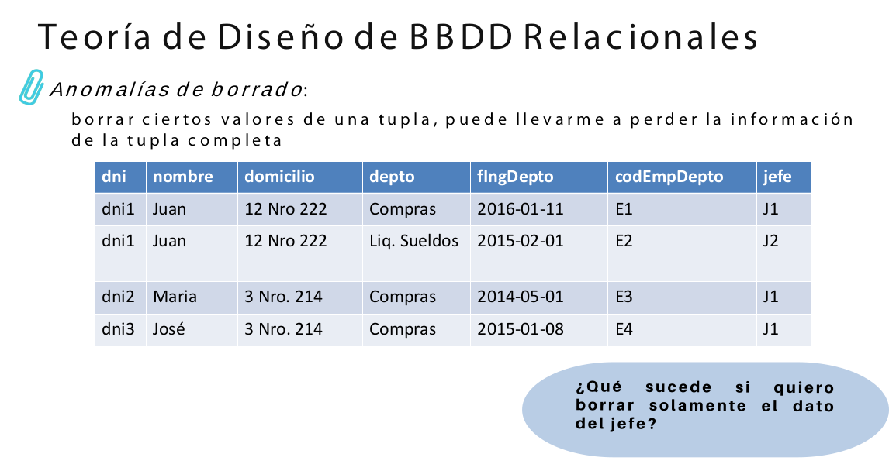
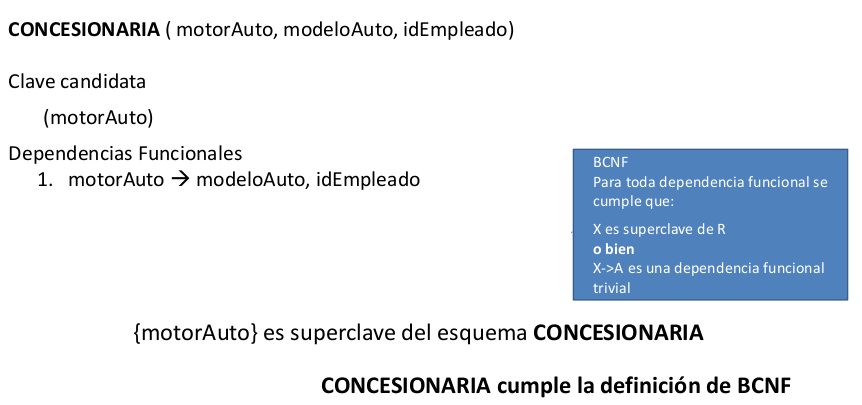

# Dudas anomalias
- No termino de entender la anomalía de borrado en el ejemplo dado
  
En este caso? al eliminar el jefe que es unico su codigo en todo el sistema significa que pierdo esa info?

# Dudas dependencias funcionales
- Utilizaremos los axiomas de Armstrong para deducir a partir de una DF el conjunto completo de DF's? o son para realizar demostraciones unicamente?

# Dudas clausura de un conjunto de atributos
- Esto entonces seria el algoritmo para encontrar X+? este X+ entonces sería el conjunto de los atributos que logramos alcanzar a partir de las DF's encontradas?

# Dudas normalizacion
En una diapositiva cuando se habla de pasar un esquema a BCNF dicen lo siguiente:  
Un esquema de relación está en BCNF sí, siempre que una dependencia funcional de la forma X->A es válida en R, entonces se cumple que:
- X es superclave de R (mínima) **¿las superclaves no es que no eran minimas?**
- o bien, X->A es una dependencia funcional trivial
La relacion esta en BCNF si es una CLAVE MINIMA ó es una DFT???

- En el ejemplo donde normalizamos se plantea la concesionaria
  
En este caso "motorAuto" no sería una "clave candidata" y no "superclave"?